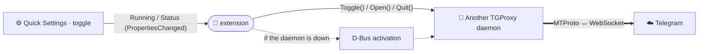

<div align="center">


# Another TGProxy — GNOME Shell extension

**A GNOME Quick Settings toggle for the Another TGProxy daemon.**

[](LICENSE)


[Русский](README.md) · **English**

</div>

---

> 🧩 Adds a toggle to GNOME Quick Settings: start/stop the proxy and see its live
> status without opening the app. Part of
> [Another TGProxy](https://github.com/Another-TGProxy).

<div align="center">


</div>

The extension doesn't run the proxy itself — it's a thin front-end to the
background **daemon** `Another TGProxy`, which it talks to over D-Bus. While the
daemon is on the bus the toggle mirrors its state and status; clicking asks it to
toggle; when the daemon is absent, clicking brings it up via D-Bus activation.



## ✨ Features

- **Quick Settings toggle** — checked = the proxy is running.
- **Live status** in the toggle subtitle (connections, traffic) — from the daemon.
- **On-demand start** — if the daemon isn't running, a click D-Bus-activates it
  (its startup brings the proxy up).
- **Status-area indicator** while the proxy is active.

## 🧩 How it works

The daemon exports `space.ampernic.AnotherTGProxy.Control1` on the bus name
`space.ampernic.AnotherTGProxy.Daemon` (path `/space/ampernic/AnotherTGProxy/Control`):

| Member | Kind | Purpose |
|---|---|---|
| `Running` | property `b` | whether the proxy is running (→ toggle state) |
| `Status` | property `s` | live status string (→ toggle subtitle) |
| `Toggle()` | method | start/stop the proxy |
| `Open()` | method | open the app window |
| `Quit()` | method | stop the daemon |

## 📦 Installation

```sh
make install      # → ~/.local/share/gnome-shell/extensions/
# On Wayland: log out and back in so the shell loads the extension
make enable
```

Build a zip for extensions.gnome.org: `make pack` (locales are compiled from `po/`).

## 🔧 Requirements

- GNOME Shell **45–48**.
- The `Another TGProxy` daemon installed (or its D-Bus `.service` for on-demand
  activation).

## 📄 License

[GPL-3.0-or-later](LICENSE).

<div align="center"><sub>Part of <b><a href="https://github.com/Another-TGProxy">Another TGProxy</a></b></sub></div>
