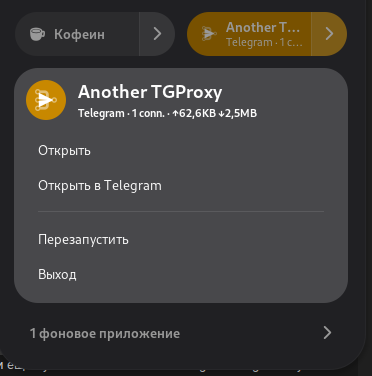
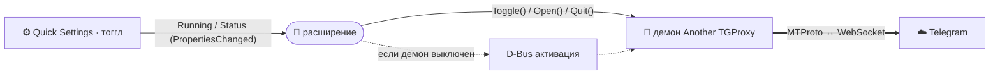

<div align="center">


# Another TGProxy — расширение GNOME Shell

**Тоггл в «Быстрых настройках» GNOME для демона Another TGProxy.**

[](LICENSE)


**Русский** · [English](README.en.md)

</div>

---

> 🧩 Добавляет переключатель в Quick Settings GNOME: включить/выключить прокси и
> видеть его живой статус, не открывая приложение. Часть проекта
> [Another TGProxy](https://github.com/Another-TGProxy).

<div align="center">



</div>

Расширение не запускает прокси само — оно тонкий фронтенд к фоновому **демону**
`Another TGProxy`, с которым общается по D-Bus. Пока демон на шине — тоггл отражает
его состояние и статус; по клику просит переключиться; когда демона нет — клик
поднимает его через D-Bus-активацию.



## ✨ Возможности

- **Тоггл в Quick Settings** — состояние = работает ли прокси.
- **Живой статус** в подписи тоггла (соединения, трафик) — приходит от демона.
- **Запуск по требованию** — если демон не запущен, клик активирует его по D-Bus
  (его автозапуск поднимает прокси).
- **Индикатор** в системной области, пока прокси активен.

## 🧩 Как это работает

Демон публикует интерфейс `space.ampernic.AnotherTGProxy.Control1` на имени
`space.ampernic.AnotherTGProxy.Daemon` (путь `/space/ampernic/AnotherTGProxy/Control`):

| Член | Тип | Назначение |
|---|---|---|
| `Running` | свойство `b` | работает ли прокси (→ состояние тоггла) |
| `Status` | свойство `s` | живая строка статуса (→ подпись тоггла) |
| `Toggle()` | метод | запустить/остановить прокси |
| `Open()` | метод | открыть окно приложения |
| `Quit()` | метод | остановить демон |

## 📦 Установка

```sh
make install      # → ~/.local/share/gnome-shell/extensions/
# На Wayland: выйдите из сессии и войдите снова, чтобы шелл увидел расширение
make enable
```

Сборка zip для extensions.gnome.org: `make pack` (локали компилируются из `po/`).

## 🔧 Требования

- GNOME Shell **45–48**.
- Установленный демон `Another TGProxy` (или его D-Bus `.service` для запуска по
  требованию).

## 📄 Лицензия

[GPL-3.0-or-later](LICENSE).

<div align="center"><sub>Часть <b><a href="https://github.com/Another-TGProxy">Another TGProxy</a></b></sub></div>
